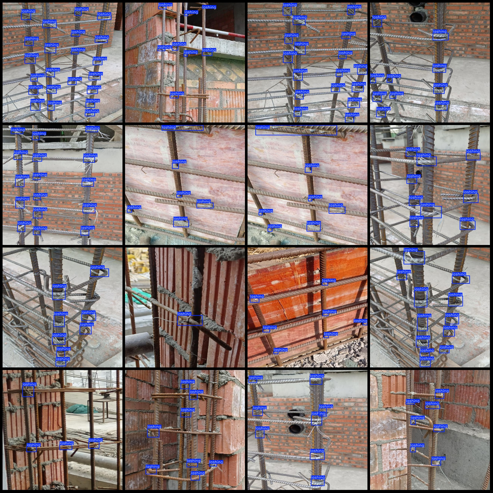
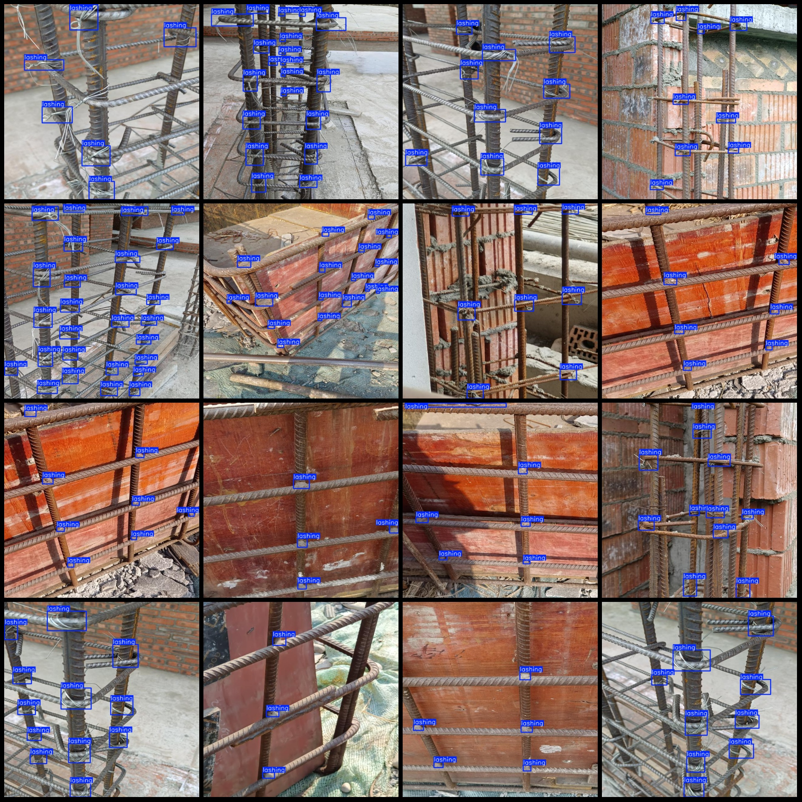

# Wisdom Construction Site Steel Frame and Reinforcing Bar Bundling Detection Data Set - VOC+YOLO Format - 203 Images in 1 Category

Dataset format: Pascal VOC format + YOLO format (txt file without split path, only containing jpg images along with corresponding VOC format xml files and YOLO format txt files)
Number of images (jpg file count): 203
Number of annotations (xml file count): 203
Number of annotations (txt file count): 203
Number of annotation categories: 1
Annotation category name: ["lashing"]
Number of bounding boxes per category: 
- "lashing" = 1716
Total number of bounding boxes: 1716
Number of images each category occupies: 
- "lashing" = 203
Image resolution: 640x640
Annotation tool used: labelImg
Annotation rules: Drawing a rectangular box around the category
Important note: The dataset does not have separate training, validation, or test sets to be divided.
Special declaration: This dataset does not guarantee the accuracy of the trained models or weight files.
Image preview:
Annotation examples:

## Images

Here is a pay link on Stripe ( https://buy.stripe.com/3cs8yP7sY87d0vu9AB ). Please contact me lonlonago@foxmail.com after funding $89, and I will send you a complete data files , thank you!

